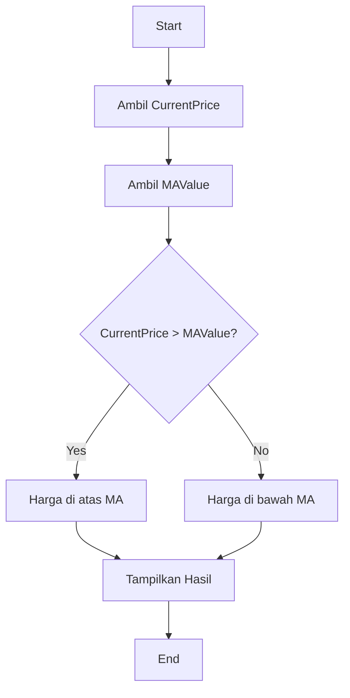
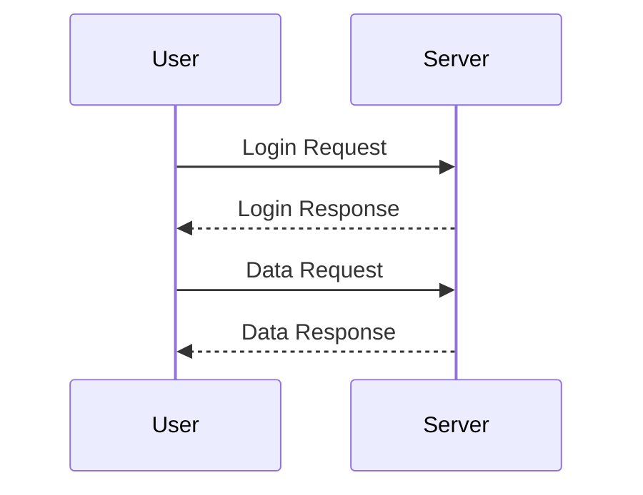
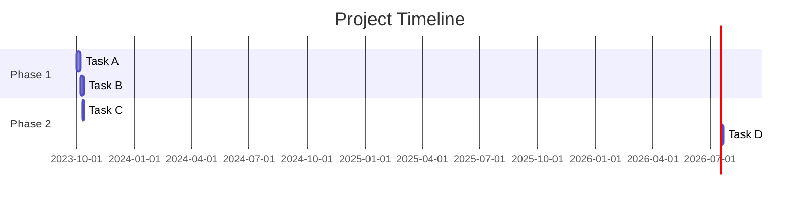
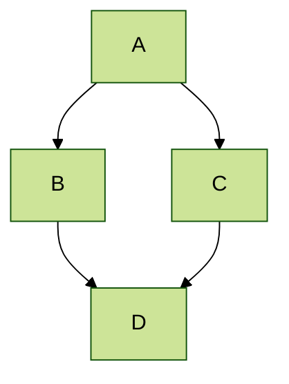
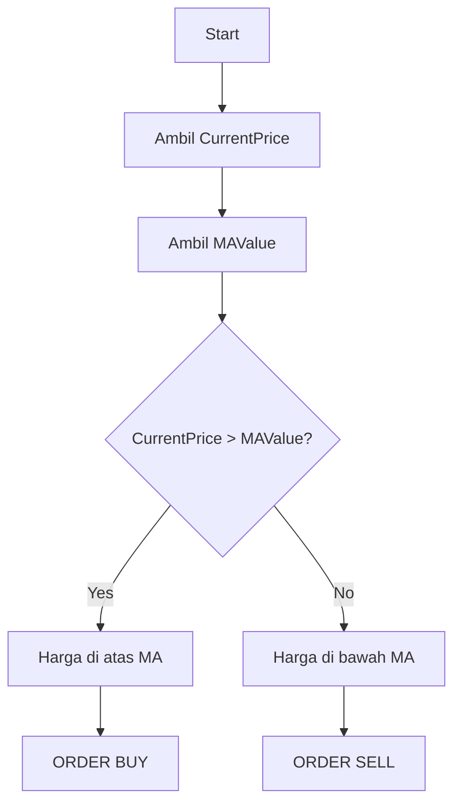
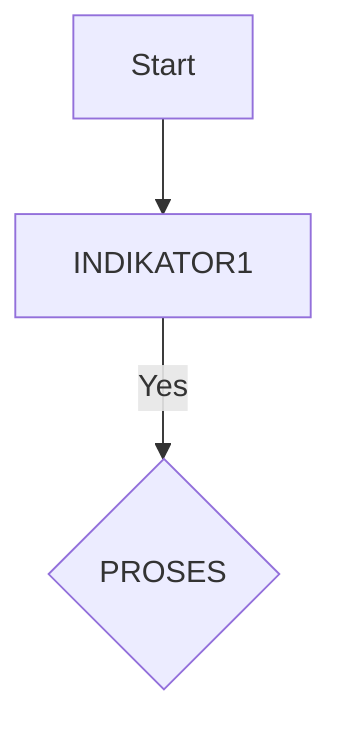

### Penjelasan:
1. **Start**: Mulai proses.
2. **Ambil CurrentPrice**: Ambil harga saat ini.
3. **Ambil MAValue**: Ambil nilai Moving Average.
4. **CurrentPrice > MAValue?**: Bandingkan harga saat ini dengan nilai MA.
   - Jika **Ya**, lanjut ke "Harga di atas MA".
   - Jika **Tidak**, lanjut ke "Harga di bawah MA".
5. **Tampilkan Hasil**: Tampilkan hasil perbandingan.
6. **End**: Akhiri proses.

---

### Implementasi dalam MQL4/MQL5:
Berikut adalah contoh implementasi logika di atas dalam bahasa MQL4/MQL5:

#
